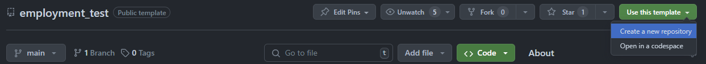

# MUGENUP Save Point事業部 フロントエンドエンジニア向け技術試験

当リポジトリは、MUGENUP Inc. Save Point事業部フロントエンドエンジニア向け技術試験のリポジトリとなります。
一次面接の通過者が対象となっております。ご興味のある方はふるってご参加ください。

## ▼求人情報詳細はこちら

- [Wantedly]()
- [Green]()

## ▼ご応募はこちら

- [MUGENUP コーポレートサイト](https://recruit.mugenup.com/entry/)

## 回答方法

1. 当リポジトリをテンプレートリポジトリとして、ご自身のGitHubアカウントの `public` リポジトリで、`{任意名}-frontend-hiring-challenge` の名前でリポジトリを作成してください。
    
2. リポジトリの作成が完了しましたら、応募媒体の機能にて、弊社採用担当に**作成したリポジトリの閲覧用URL**を送付ください。
3. 各問題は当リポジトリの `docs/` 以下に格納してあります。内容を確認してください。
    - この時点ではまだ「試験開始」とはなりません。
    - 不明点がある場合は、**ご自身のリポジトリの `Issue`** に質問を記載してください。
4. 質疑応答が完了し、着手する準備が整いましたら、応募媒体の機能にて、**「試験開始」**の旨を弊社採用担当にお知らせください。（ここから回答期間のカウントが始まります）
5. 受験が完了しましたら、応募媒体の機能にて、弊社採用担当にお知らせください。

## 回答期間

推奨：**試験開始の宣言から 20日以内**
（慣れた方なら4時間〜8時間程度で回答できる難易度を想定しておりますが、ご自身のペースで取り組んでいただけます）

## よくある質問と注意事項 (FAQ)

### Q. 質問や問い合わせは可能ですか？

**A. 「試験開始」の宣言前のみ受け付けています。**  
リポジトリ作成後、問題文を読み込み、不明点や技術的な質問がある場合は、**作成したご自身のリポジトリの `Issue`** に質問内容を記載してください。  
原則として3営業日以内に回答（コメント）いたします。

**ご注意：**
応募媒体にて「試験開始」を宣言した後は、いかなる質問（要件の確認や技術的な相談など）にもお答えできませんので、すべての疑問点を解消してから開始してください。

### Q. 生成AI（ChatGPT, GitHub Copilot等）を使用しても良いですか？

**A. はい、積極的に活用してください。**
本試験では、AIツールを活用して効率的に実装するスキルも評価の対象となります。
ただし、以下の点にご注意ください。

1. **コードの理解**: AIが生成したコードの内容を完全に理解し、なぜその実装を選んだのかを説明できるようにしてください。
2. **品質の担保**: AIが生成するコードには、古い記述やセキュリティ上の懸念が含まれることがあります。それらを鵜呑みにせず、適切に修正・最適化する能力を求めます。
3. **ブラックボックス化の回避**: 複雑なロジックをAI任せにしすぎないでください。「なぜ動いているかわからない」状態は減点対象となります。

### Q. すべての問題を完答する必要がありますか？

**A. 可能な限り完答を目指してください。**  
とくに **Q1〜Q6（環境構築〜モダナイゼーション）** は、その後の開発の基盤となるため必須です。  
Q7以降の応用課題については、時間が足りない場合でも
- 「どこまで実装し、何が残っているか」
- 「どのように実装する予定だったか」

等をドキュメントに残していただければ、その思考プロセスを評価いたします。

### Q. 提出用のリポジトリはPublicにする必要がありますか？

**A. はい、Publicリポジトリとして作成してください。**  
提出は、作成したGitHubリポジトリのURLを採用担当者に送付する形で行います。  
リポジトリ名は `{ご自身のアカウント名}-frontend-hiring-challenge` としてください。

### Q. 回答のPRが前の問題の解答を踏まえたものが多いです。どのように回答すべきですか？

**A. featureブランチのネストパターンを許可します。**  
前の課題のブランチから派生させて次の課題のブランチを作成していただいて構いません。

### Q. 評価のポイントを教えてください。

**A. 「動くものを作れる」ことは大前提として、以下のような「エンジニアリングの質」を重点的に評価します。**

- **モダナイゼーション能力**: レガシーな環境（`Webpack`等）からモダンな環境（`Vite`等）へ、適切に移行できるか。
- **設計能力**: コンポーネントの粒度、再利用性、ディレクトリ構成が適切か。
- **非機能要件への配慮**: パフォーマンス、アクセシビリティ、エラーハンドリングが考慮されているか。
- **Gitの作法**: コミットメッセージの粒度、ブランチ戦略（git-flow）、署名付きコミットができているか。
- **ドキュメンテーション**: PRの説明欄や `manual/` ディレクトリで、自身の思考プロセス（Why）を言語化できているか。

### Q. 使用するライブラリに制限はありますか？

**A. 基本的に制限はありません。**  
課題解決に最適だと判断したライブラリ（UIフレームワーク、ユーティリティ等）は自由に追加して構いません。  
ただし、ライブラリを選定した理由を明確にPR等に記載するようにしておいてください。