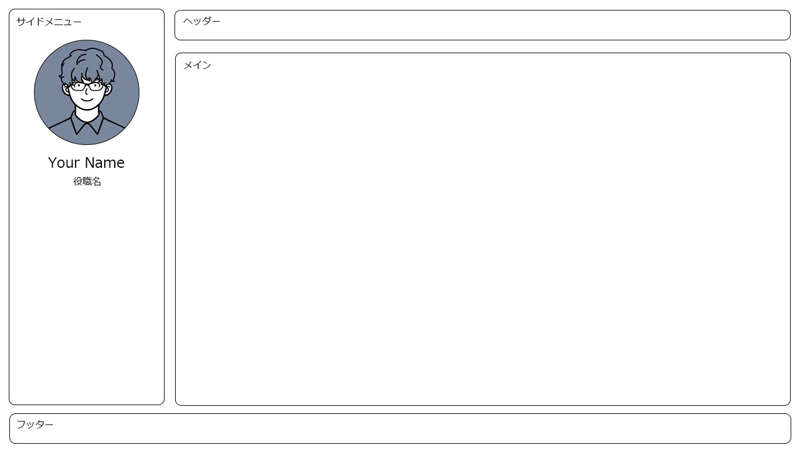

# 第三問：コーディング

下記要件を満たす`Pull Request`を `featureブランチ` として作成してください。

## 要件

1. `npm run dev`を実行し、`localhost:3000` を開いた際に、図のレイアウトを満たすように、コーディングを行ってください。
2. `vue` ファイル内部で、画像をインポートができるように、`webpack.config.js`を変更してください
3. `npm run build` を実行した際に、`dist` に画像などのアセットを含むようにしてください。

### 補足

- `HTML` レベルで可能な限り、セマンティックになるようにしてください
- 変更するファイルは、`vueファイル` と `cssファイル` とします
- マージンやパディング、ボーダーを図と同じように統一する必要はありません
- 画像は、`app/src/assets/images` に格納してあります
- 必要に応じて `npm` でライブラリを追加してもかまいません
- ファイル名等は変わってもかまいませんが、アセットの出力先は `app/dist/assets`となるようにしてください。
