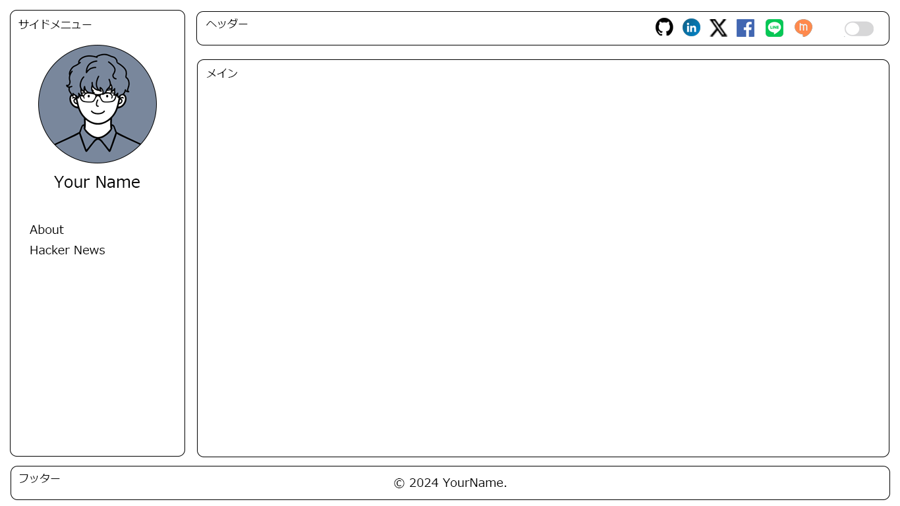

# 第五問：ダークモード/ライトモードの切替

下記要件を満たす`Pull Request`を `featureブランチ` として作成してください。

### 資料

## 要件

- 右上にあるトグルボタンのコンポーネントを実装し、ダークモードとライトモードが切り替えられるようにしてください。
- またその設定を何らかの形（`localStorage` や `Cookie` など）で記憶し、設定が維持されるようにしてください。
- 上記の設定が存在しない場合、システムのデフォルトが適用されるようにしてください

### 補足

- 装飾や配色については、自由に加筆してかまいません。
